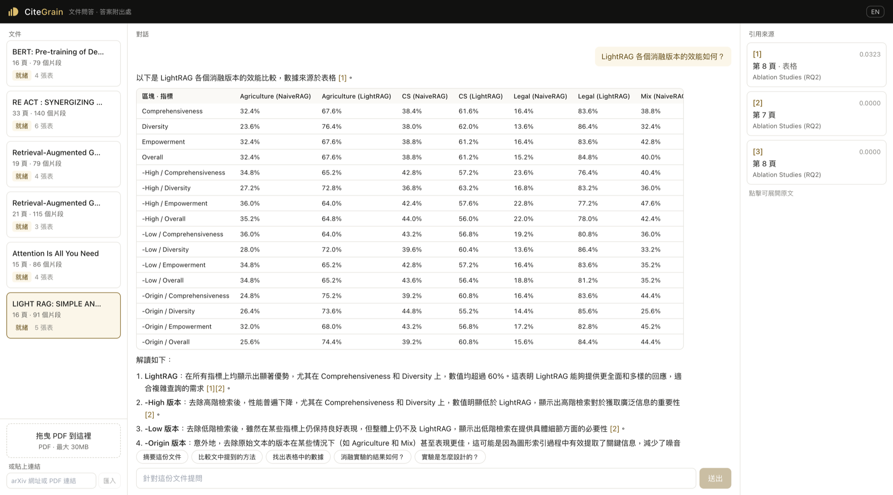

# CiteGrain

**受限脈絡下的長文件可追溯問答系統**

CiteGrain 是一套面向學術 PDF 的長文件問答系統。使用者可上傳 PDF 或貼入 arXiv 連結，
以自然語言提問，系統會根據文件內容回答並附上頁碼與章節來源。

在 **10K tokens 的脈絡上限**下，系統以結構感知切分、混合檢索、token-aware context packing
與階層式摘要處理數萬 tokens 的長文件；PDF 解析、表格還原與向量化皆在本機完成，
語言模型僅負責 text-to-text generation。

---

## Highlights

- **10K context constraint** — 依實際 query token 數動態計算 retrieval budget，
  保證 system prompt ＋ question ＋ context ＋ answer 的總量不超過模型上限
- **Structure-aware RAG** — 章節感知切分（四級級聯）＋ Vector / BM25 ＋ RRF fusion
- **Reliable table QA** — 以版面幾何還原表格，並以數值多重集守恆與鍵唯一性驗證後才進索引
- **Traceable answers** — 回答附頁碼與章節來源，可直接展開原文核對
- **Local-first processing** — PDF 解析、切塊、向量化全程本地完成，索引階段外部 API 呼叫為 0
- **Reproducible evaluation** — 68 項自動化測試 ＋ 端到端驗收 ＋ 可重跑的檢索與壓力測試

---

## Demo



左為文件清單、中為回答、右為引用來源。圖中的問題是作業指定的第三題
（LightRAG 消融版本的效能），答案完全來自論文表格 —— 由系統還原並驗證後索引，
而非模型自行生成。

---

## 快速開始

需求：Docker 與 Docker Compose。

```bash
git clone https://github.com/Yunwcy/citegrain.git
cd citegrain
cp .env.example .env          # 填入 OPENAI_API_KEY
docker compose up -d --build  # 首次約 3–5 分鐘，含下載本地向量化模型
```

啟動後開 http://localhost:3000，貼上 `https://arxiv.org/pdf/2410.05779` 即可提問。

| 服務 | 位置 | 用途 |
|---|---|---|
| 介面 | http://localhost:3000 | 上傳文件、提問、檢視引用來源 |
| API 文件 | http://localhost:8000/docs | 端點的參數與回應格式，可直接於頁面試打 |
| 指標 | http://localhost:8000/api/metrics | Prometheus 格式的查詢次數、延遲、成本、準確度 |
| 儀表板 | http://localhost:3001 | 上述指標的視覺化 |

不使用容器時：

```bash
python -m venv .venv && .venv/bin/pip install -r backend/requirements.txt
.venv/bin/uvicorn app.main:app --app-dir backend --port 8000
cd frontend && npm install && npm run dev
```

### 設定

所有可調參數集中於 `backend/app/config.py`，可由環境變數覆寫。

| 參數 | 預設 | 說明 |
|---|---|---|
| `OPENAI_API_KEY` | — | 必填 |
| `LLM_MODEL` | `gpt-4o-mini` | 僅用於 text-to-text |
| `MAX_CONTEXT` | `10000` | 假設的模型脈絡上限 |
| `CHUNK_TARGET_TOKENS` | `450` | 片段目標長度 |
| `TOP_K` | `8` | 融合後取用的片段數 |
| `EMBEDDING_BACKEND` | `onnx` | 本地向量化，不經外部服務 |

---

## 系統架構


```
上傳 ─▶ 版面分析 ─▶ 章節偵測 ─▶ 表格抽取＋驗證 ─▶ 切塊 ─▶ 向量與 BM25 索引
                                                                  │
提問 ─▶ 查詢路由 ─▶ 混合檢索 ─▶ RRF 融合 ─▶ 脈絡預算組裝 ─▶ 模型 ─▶ 引用擷取
```

- **Structure-aware chunking** — PDF 大綱 → 編號規則 → 字級分群 → 遞迴切分；表格保持 atomic
- **Table reconstruction** — 以版面橫線為幾何錨點還原儲存格，再以數值多重集與鍵唯一性驗證
- **Hybrid retrieval** — multilingual embedding ＋ BM25，結果以 RRF（k=60）融合
- **Query routing** — 摘要／比較／表格查詢／一般問答採不同策略
- **Hierarchical summarization** — 以章節為單位 map-reduce，避免摘要只看到局部內容
- **Token-aware packing** — 依實際 token budget 組裝脈絡，表格不允許截斷

詳細設計見 [`docs/architecture.md`](docs/architecture.md)。

---

## 設計約束

三項約束決定了絕大多數的架構選擇：

| 約束 | 理由 | 對應設計 |
|---|---|---|
| 文件解析不依賴外部服務 | 文件內容不外流，且結果可重現、不隨供應商版本變動 | 版面分析、章節偵測、表格抽取、向量化全部本地執行 |
| 語言模型只做 text-to-text | 不綁定特定供應商的多模態能力，換模型不必改動管線 | 全專案僅一處呼叫模型，介面只接受與回傳字串 |
| 脈絡上限視為 10K tokens | 應對小脈絡模型處理長文件的情境 | 檢索內容依 token 預算組裝，一般情況為 6,000 tokens |

脈絡預算由設定推導，不另行設定：

```python
retrieval_budget = max_context − system_reserved − question_reserved
                   − answer_reserved − safety_margin      # = 6,000
```

實際額度並非固定值，而是由 `Settings.budget_for()` 依每次請求的 query token 數動態計算。
因此即使遇到中文或 emoji 等高 token-density 的輸入，system prompt、question、
retrieved context 與 answer 的總和仍不會超過 10K。

三項約束皆以自動化測試驗證，包括：

- 全專案僅有單一 external-call boundary
- 向量化後端不允許外部服務
- 最壞情況下的總 token 量仍 ≤ 10,000

詳見 [`docs/testing.md`](docs/testing.md)。

---

## 量測結果

四篇不同排版的論文實測，全部可由指令重現，報表位於 [`docs/results/`](docs/results/)。

### 檢索準確度

12 個測試問題（合計 22 項判定），涵蓋 7 個章節、中英文各半。
判準為目標章節是否進入檢索結果前三名。以系統自身做消融：

| 設定 | 命中前三名 |
|---|---|
| 基準：固定視窗切塊 · 純向量檢索 · 不處理表格 | **0%** |
| ＋結構感知切塊 | **75%** |
| 完整系統：＋混合檢索 ＋表格處理 | **95%**（21/22） |

其中「消融版本的效能」一題唯有表格處理能命中 —— 該題答案位於表格內。

跨語言查詢（以中文提問英文文件）初期明顯較差：關鍵字檢索在跨語言時無法貢獻，
等同僅剩向量檢索。將章節標題併入向量化內容後，該類查詢的排名由第 6、第 9 名提升至第 1 名。

### 表格保真度

- 偵測到 17 張表：數值型 13 張、敘述型 2 張、驗證未通過 2 張
- **數值型表格驗證通過率 13/13**
- **錯誤儲存格進入索引的比率為 0** —— 未通過驗證者一律清空儲存格、僅保留整表原文

### 泛用性

另外以 Attention Is All You Need、BERT、RAG 三篇不同版面的論文驗證；
涵蓋單欄、雙欄、具／不具 PDF 內建大綱的文件，皆能取得章節結構
（其中一篇無大綱，由級聯的第二級接手）。逐篇數據見
[`docs/results/retrieval.md`](docs/results/retrieval.md)。

### 併發

| 情境 | 檢索 p50 | 檢索 p95 | 端到端 p50 |
|---|---:|---:|---:|
| 1 併發 | 28 ms | 28 ms | 3.5 s |
| 5 併發 | 30 ms | 35 ms | 1.7 s |
| 20 併發 | 68 ms | 92 ms | 5.0 s |
| 20 併發 ＋ 同時上傳 | 84 ms | 108 ms | 6.1 s |

端到端時間由模型生成主導，屬於外部延遲；`retrieval_ms` 才是本服務自身控制的部分。
索引與查詢使用各自獨立的 ONNX 推論工作階段，避免大量建索引工作阻塞即時查詢。

### 回答品質

| 結果 | 次數 |
|---|---:|
| 有標註引用 | 144 |
| 有作答但未標註引用 | **0** |
| 文件未涵蓋而如實拒答 | 23 |

引用率只計算實際作答的案例；文件未涵蓋而正確拒答的查詢不納入分母。

### 成本

單次查詢平均 US$0.000785，脈絡用量中位數 2,723 / 6,000 tokens；
索引階段外部 API 呼叫 0 次（向量化全程本地）。

---

## 對外介面

主要端點：

```text
POST /api/documents              # 上傳 PDF
POST /api/documents/from-url     # 由 arXiv 或 PDF 連結匯入
POST /api/query                  # 問答（SSE 串流）
GET  /api/jobs/{id}/events       # 索引進度（SSE 串流）
GET  /api/metrics                # Prometheus 指標
```

完整 API（含文件清單、詳情、刪除、摘要）：Swagger UI → `http://localhost:8000/docs`

### MCP server

```bash
python -m app.mcp_server
```

提供 `search_document`、`get_table_cell`、`summarize_document`、`list_documents` 四個工具。
`get_table_cell` 為確定性查表，值取自結構化索引而非模型生成。

---

## 專案結構

```
backend/app/
├─ config.py          參數集中管理，評估對照組由此切換
├─ llm/client.py      全專案唯一的模型呼叫出口
├─ util/tokens.py     統一以 cl100k_base 計數
├─ parser/            PDF 解析、版面分析、表格抽取
├─ chunking/          章節偵測與切塊
├─ retrieval/         向量、BM25、融合、脈絡預算
├─ router/            查詢路由
├─ summarization/     階層式摘要
└─ api/               HTTP 介面
frontend/src/         React 介面
ops/                  Prometheus 與 Grafana 設定
scripts/              評估、壓測、端到端驗收
```

---

## 測試與可重現性

```bash
cd backend && python -m pytest tests -q                      # 68 項測試
python scripts/e2e.py --offline --generality --full          # 端到端驗收（經 nginx）
python scripts/check_docs.py                                 # 文件數字與產出一致
```

目前共 **68 項自動化測試**，端到端驗收另涵蓋反向代理、SSE、重啟後資料保存、
模型離線時仍能建立索引、跨文件泛用性，以及文件數字與產出的一致性。

### 重現本文的量測數字

`docs/results/` 底下每一份報表都由指令產生，沒有一個數字是手打的。
本節所有數字皆可由以下步驟重跑：

```bash
python -m venv .venv && .venv/bin/pip install -r backend/requirements.txt
bash scripts/fetch_test_docs.sh                                    # 取得四篇測試論文
.venv/bin/python scripts/eval.py --md docs/results/retrieval.md    # 檢索準確度、表格保真度、泛用性
.venv/bin/python scripts/loadtest.py --md docs/results/load.md     # 併發（需服務已啟動）
.venv/bin/python scripts/report.py --container --md docs/results/runtime.md  # 成本與回答品質
```

README 引用的數字由 `scripts/check_docs.py` 逐項核對，CI 於每次推送執行 —— 對不上即失敗。

從零建置驗證（`--no-cache` 重建，確認相依都有宣告而非本機剛好有）：

```bash
bash scripts/verify_clean_build.sh                                 # 約 10–20 分鐘
```

完整測試說明與所有選項見 [`docs/testing.md`](docs/testing.md)。
