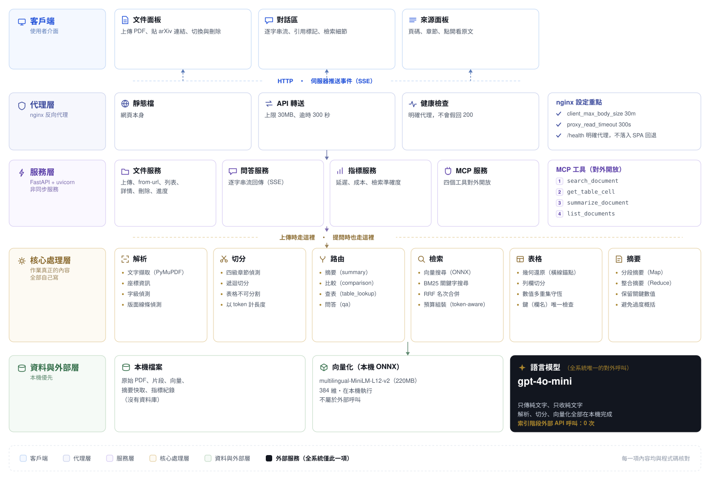

# 系統架構

本文件說明 CiteGrain 的設計與實作。所有數字皆為實測值，重現指令見 README。

---

## 1. 設計限制如何決定架構

三項限制決定了絕大多數的架構選擇：

| 限制 | 對應設計 | 可驗證的證據 |
|---|---|---|
| 不得使用商用 API 解析文件 | 版面分析、章節偵測、表格抽取、向量化全部在本地執行 | `test_只有一個檔案能連到外部模型服務`；`/api/metrics` 的 `citegrain_index_external_api_calls_total` 恆為 0 |
| 語言模型只做 text-to-text | 全專案僅 `app/llm/client.py` 呼叫模型，介面只接受與回傳字串 | `test_模型介面只收字串只回字串`、`test_送進模型的訊息內容都是純文字` |
| 假設脈絡上限 10K tokens | 檢索額度依每次請求的問題長度計算，一般情況為 6,000 tokens | `test_總量在最壞情況下也不超過作業上限`、`test_系統提示放得進保留額度` |

脈絡預算的拆分方式：

```
 10,000  假設的模型脈絡上限
 -1,800  系統提示（提示詞實際 token 數，由測試守著）
   -200  使用者問題（保留下限）
 -1,500  回答保留
   -500  安全邊際
────────
  6,000  檢索內容上限
```

此數值由 `config.py` 計算而得，非寫死 —— 文件與程式碼不會出現不一致。

問題長度上限設在字元（1,000），而 1,000 個中文字元約 920 tokens，
超過上表的 200。因此實際額度取 `Settings.budget_for(question_tokens)`，
問題越長、檢索額度越少，確保四項總和在任何輸入下都不超過 10,000。

---

## 1.1 分層



## 2. 索引流程

```
PDF ─► 解析 ─► 文件特徵偵測 ─┬─► 章節偵測級聯 ─► 結構感知切塊 ─┐
                            │                                  ├─► chunks.json
                            └─► 表格區域偵測 ─► 儲存格還原 ─────┤   tables.json
                                              └─► 數值守恆驗證  │
                                                                └─► 向量 + BM25
                                    （背景）階層式摘要 ─────────────► summary.json
```

### 2.1 文件特徵偵測
上傳時先偵測文字層、欄數、字級階層、版面線條分布與 PDF 內建大綱，
再據此選擇後續策略。每一項判斷都回報依據 —— 系統必須能說明「為什麼選這條路」。

欄數以「有多少區塊橫跨頁面中線」判定，排除首頁（標題與摘要常橫跨整頁）
與過窄區塊（圖說與公式在雙欄版面同樣不跨線，會稀釋訊號）。

### 2.2 章節偵測級聯
單一規則無法涵蓋不同排版。四級級聯，並回報實際採用的級別：

1. `doc.get_toc()` —— PDF 內建大綱，精確且免費
2. 多組編號規則 —— `1.2`、`第三章`、`Chapter 3`、羅馬數字、全大寫標題
3. 字型分群 —— 比內文大 8% 以上的字級聚類成標題階層
4. 全部失敗 —— 退回純遞迴切塊，並標示未偵測到章節結構

四篇不同排版的論文實測：三篇由第一級取得，一篇（雙欄且無大綱）由第二級接手。

定位標題時逐項傳入下限位置，只接受晚於前一章節的命中。
少了這道限制，內文中先出現的同名片語會搶走標題位置，使章節順序錯亂。

### 2.3 表格抽取
不使用 PyMuPDF 內建的 `find_tables()`：對目標論文實測後，
`lines_strict` 幾乎抓不到（論文使用 booktabs，無垂直框線），
`text` 策略則把每一頁的正文段落誤判成表格。

改採版面線條為幾何錨點：

1. **區域偵測** —— 取水平線條並依垂直間距分群，僅保留左右端點一致者。
   真正的表格其上中下線幾乎等寬；混入的圖框線會把區域撐大到整頁
2. **儲存格還原** —— 區域內字元依 y 分列、依 x 間距分欄，保留每格的 x 範圍
3. **表頭解析** —— 多層表頭以 x 重疊配對，再以相鄰儲存格中線補上未覆蓋的欄。
   **內文列不做此補位** —— 內文的儲存格數少於欄數代表缺值，補位會複製相鄰數值
4. **線性化** —— 每列轉為「欄名 = 值」的自然語言，使關鍵字與語意檢索都能命中
5. **驗證** —— 見下節

### 2.4 表格驗證
表格解析錯誤不會拋出例外，只會讓數值悄悄跑到別欄或消失。因此設兩道斷言：

- **數值多重集守恆** —— 表格區域內的所有數值，與還原後儲存格中的所有數值必須完全相同
- **鍵唯一性** —— 字典鍵數須等於實際值數

第二道是必要的：守恆檢查比對的是串列，而確定性查表使用的是字典。
曾出現串列守恆通過、字典卻已靜默覆寫的情形 —— 檢查顯示通過，資料卻是錯的。

**未通過驗證者一律清空儲存格，僅保留整表原文。**
確定性查表的價值來自可信度，一個可能錯誤的儲存格比沒有儲存格更糟。

### 2.5 切塊
結構優先、遞迴為輔、表格原子化：

| 層 | 方法 |
|---|---|
| 1 | 以章節切分 |
| 2 | 章節內超過 450 tokens 才遞迴切分（`\n\n` → `\n` → 句末 → 空白） |
| 3 | 表格永不切分；另產出逐列片段 |

不採用語意切塊（以嵌入相似度找斷點）的理由：學術文獻的結構信號強於語意漂移信號；
每句都需向量化，成本上升；且斷點不穩定，同一份文件重跑結果會變，破壞評估的可重現性。

### 2.6 摘要
摘要不能走一般檢索：top-k 取回的是「與『摘要』一詞最相似的片段」，
產出的是 retrieval summary 而非 document summary —— 看起來像摘要，
實際只涵蓋文件的一小部分，且無從得知漏了什麼。

改以章節為 map 單位做 map-reduce，結果快取。map 單位依**長度**而非章節數決定 ——
一級章節太粗會讓關鍵證據在平均之後消失。目標論文為 12 段、13 次模型呼叫、
約 14 秒；之後命中快取為毫秒級。章節摘要與語言無關且只做一次，
最終整合依語言各自快取，因此第一次改用英文只需一次呼叫。

**索引完成即發出 `ready`，摘要在背景繼續。** 先前是等摘要做完才發，
使用者要等三十餘秒才能問任何問題 —— 即使那個問題根本不需要摘要。
中文與英文兩種摘要都預先建好：章節摘要與語言無關只做一次，
第二種語言只多一次整合呼叫。建立中途若有人要求摘要，
以每份文件一把鎖讓它等這次完成，而不是另起一次重複的建立。

**摘要是整條索引管線唯一需要外部服務的一步，因此它的失敗不得傳染。**
失敗時文件仍標記為 `ready` 並附帶 `summary_ready=false`，索引已完成、可以提問；
摘要在使用者實際要求時重試。斷網實測：解析、切塊、向量化全部成功，
僅此步失敗 —— 若讓它使整份文件失敗，介面會顯示「連線錯誤」，
看起來像整個上傳都沒成功。

未快取時的進度以 SSE 送出（`步驟 1/2：逐節摘要（7/13）`）——
十四秒的空白畫面會被當成當機，而這正是最值得展示的一段。

---

## 3. 查詢流程

```
提問 ─► 路由 ─┬─ summary       ─► 讀快取
              ├─ comparison    ─► 五路子查詢 ─► 輪流取名額 ─► RRF 排序
              ├─ table_lookup  ─► 整張表優先置入
              └─ qa            ─► 向量 + BM25 ─► RRF
                                        │
                              脈絡預算組裝（6,000 上限）
                                        │
                              模型生成（SSE 串流）
                                        │
                              答案 + 引用（頁碼 · 章節）
```

### 3.1 路由
三個指定問題其實是三種不同的檢索任務，用同一套 top-k 必然有一項做不好。
路由採規則優先而非模型分類：省一次往返，且同一問題永遠走同一條路徑，
評估數據因此可重現。

`table_lookup` 需同時命中某張表的兩個以上座標標籤才觸發 ——
只命中一個（例如「Legal」）很可能只是正文用詞。

### 3.2 比較類問題的多路檢索
單一查詢容易只命中被比較的其中一方。拆為五路子查詢（雙方架構、效能、成本、原問題）
後，仍需注意融合策略：僅用 RRF 時，最強的一路會連續佔位 ——
實測九個片段全部來自同一節，架構與成本兩個面向完全未進入脈絡。

因此改為輪流各取一名填滿名額，再以 RRF 決定呈現順序。
對比較類問題而言，覆蓋面是正確性條件而非多樣性偏好。

### 3.3 混合檢索
向量檢索使用 numpy 內積。單一文件約 300 個片段，
原訂使用的 FAISS `IndexFlatIP` 本即暴力精確搜尋，結果與此相同；
FAISS 的價值在近似索引，而近似是以召回率換取速度 —— 此規模不需要。

向量化與 BM25 的輸入均包含章節標題。片段本身不含標題時，
向量只反映段落文字，模型無從得知它屬於哪一節 —— 以章節主題發問的問題
因此排不上前面。實測跨語言查詢的排名由第 6、第 9 名提升至第 1 名。

關鍵字檢索使用 BM25，CJK 以 jieba 斷詞。
需注意 BM25 在跨語言時無法貢獻（中文查詢對英文文件字面零重疊），
此時混合檢索實際上僅剩向量一半的效力。
表格逐列線性化後，`Diversity`、`-High`、`Legal` 這些詞才成為可被關鍵字命中的 token。

融合採 RRF（`1/(60+rank)`）而非加權分數和：兩者量綱不同，
正規化對離群值敏感且隨語料改變，RRF 只看名次，對異質檢索器穩定得多。

### 3.4 脈絡預算
依融合分數依序放入，超出預算時先於句子邊界裁切，仍放不下才捨棄，
並記錄被捨棄的片段。「有東西被捨棄」必須是看得見的。

**表格永不裁切** —— 少了幾列的表格會讓模型讀出錯誤的欄列對應，比沒有這張表更危險。

**表格展開** —— 命中表格任一列時，整張表一併帶入（僅一次）。
未做此處理時，模型只看得到被命中的四列，卻據此回答關於整張表的問題：
實測產生了引用正確、數值正確、但完全沒有涵蓋三個消融變體的答案。

**兩兩對比表的區塊限定** —— 勝率表的每一列是「本方法對某一個基準方法」的
兩兩對比，同一資料集內的兩個數值相加為 100%。整張 16 列送進脈絡時，
模型會把「對 A 那一列的數值」與「對 B 那一列的數值」並列 ——
每個數字單獨看都存在於論文中，配對之後全錯（實測四組總和為 132、112.8、127.2、132）。

處理分兩層：整表片段開頭標明此表為兩兩對比（放在每一列末尾實測無效，
埋在長列尾端的限制等於沒有寫）；問題點名了比較對象時，
**直接濾掉其他區塊的列**，不留給模型混用的機會。
過濾必須只比對列標題 —— 比對整行時每一行的欄名都含本方法名稱，等於沒有過濾。

這條規則可機械驗證：一組數值相加不等於 100% 即為錯配，已納入端到端驗收。

---

## 4. 併發

| 面向 | 作法 |
|---|---|
| 事件迴圈 | 所有 CPU 工作以 `asyncio.to_thread` 移出，避免整個服務停住 |
| 狀態一致性 | 磁碟為唯一真相來源，記憶體僅作 LRU 快取 |
| 排程隔離 | 建索引序列化（1），查詢向量化限流（4），模型呼叫限流（8） |
| **推論資源隔離** | 索引與查詢使用各自獨立的 ONNX 工作階段 |

最後一項是實測才發現的：前三項完成後，20 個併發查詢下同時上傳一份文件，
檢索中位數由 44 ms 升至 733 ms。兩組 semaphore 隔離的是排程，
沒有隔離推論資源 —— 單一 ONNX session 內部是序列化的，
查詢的單句向量化因此排在整批片段之後。改為獨立工作階段後降回 92 ms。

---

## 5. 外部失敗的處理

系統只有一個外部依賴（語言模型），因此它的三種失敗方式都必須有明確語意，
不能一律歸為「錯誤」：

| 失敗 | 偵測方式 | 呈現 |
|---|---|---|
| 索引時無法連線 | 摘要步驟例外 | 文件仍 `ready`，附 `summary_ready=false` |
| 生成中途斷線 | 串流例外 | `debug.stream_error`，介面標示「答案並未寫完」 |
| 撞到輸出長度上限 | `finish_reason == "length"` | `debug.answer_truncated`，介面標示「內容可能不完整」 |

後兩者原本都不可見：例外會讓 SSE 直接斷線、`done` 永不送出，
前端只剩半段文字而看起來只是「比較短的回答」。
改為接住例外並照常送出 `done`，來源、用量與中斷標記都能到達前端。

---

## 6. 可觀測性

每次索引與查詢寫一筆 JSON Lines 到 `storage/metrics.jsonl`，
同一筆事件同步更新 Prometheus 指標並由 `/api/metrics` 輸出。
兩者同源，不會出現「報表與儀表板數字對不上」。

選 JSONL 而非 CSV：欄位會隨功能增加而變動，JSONL 對缺欄位寬容，
CSV 一旦加欄位舊資料就對不上。

儀表板同時呈現兩類指標：

- **即時指標** —— 查詢量、延遲、脈絡用量、成本，以及回答結果的三分法
  （有標註引用／有作答但未標註／文件未涵蓋而拒答）。
  引用率的分母排除拒答：文件未涵蓋時模型應如實說明，
  這類回答沒有可標註的來源，計入會把正確行為算成失敗
- **離線評估** —— 檢索準確度與表格解析結果，由 `scripts/eval.py --publish`
  送至 `/api/eval` 轉為 gauge。檢索準確度需事先標註目標章節，無法即時計算

摘要路由不走檢索也不組裝脈絡，其 token 與耗時不計入對應的直方圖 ——
一併記入會在圖上產生不存在的凹陷。

**脈絡用量與 prompt 長度分開量測。** `prompt_tokens` 含系統提示與問題，
本來就會超過 6,000 的檢索預算；拿它畫「脈絡用量」的面板，
會讓線剛好壓在上限上，而面板說明寫著「從未觸及上限」——
圖表與自己的說明互相矛盾。因此另設 `context_tokens` 直方圖。

**Counter 與 Histogram 都在行程記憶體裡，重啟即歸零**，
但 `metrics.jsonl` 完整保留著。啟動時重放既有紀錄，
評估 gauge 亦由 `eval.json` 還原 —— 否則重啟一次，儀表板看起來就像沒人用過。

Grafana 儀表板以檔案預先配置，`docker compose up` 後即有數據。
九個面板中最具說明力的是「延遲拆解：檢索 vs 生成」——
它以圖說明檢索佔端到端時間不到 2%，其餘為模型生成。

---

## 7. 驗證與回歸防護

這個系統的錯誤多數不會拋例外：表格挪一格、章節邊界錯開、
答案配錯欄位、文件數字過期 —— 全都「跑得動」。因此驗證分三層，
每一層各有抓不到的東西：

| 層 | 涵蓋 | 抓不到 |
|---|---|---|
| `pytest`（TestClient，同行程） | 元件邏輯、解析正確性、不變量 | 反向代理、真實 HTTP、容器行為 |
| `scripts/check_docs.py` | 文件數字與產出報表一致 | 程式行為 |
| `scripts/e2e.py`（經 nginx） | 全鏈路、外部服務中斷、重啟保存 | 視覺呈現 |

單元測試繞過反向代理，而實際踩過的整合問題正好都在那一層：
上傳上限 413、後端停用時 `/health` 仍因 SPA fallback 回 200、
SSE 被緩衝。`e2e.py` 因此一律連 nginx（:3000），不直接連後端埠。

**每個修過的缺陷都留下一項測試**，測試名稱即為病歷：

| 曾經的缺陷 | 對應測試 |
|---|---|
| 表格數值錯位 | 數值多重集守恆 |
| 列標籤碰撞、值被靜默覆寫 | 鍵數必須等於值數 |
| 章節 3.1 排到 3 之前 | 章節順序單調遞增 |
| 第一節之前的內容被丟棄 | 首節必須是 Abstract 或 Front matter |
| 索引得到但檢索不到 | 文件資訊片段必須可檢索 |
| 多區塊表格只有最後一區塊可路由 | 每個區塊都能命中表格查詢 |
| 串流答完後崩潰、`done` 未送出 | 以假模型跑完整條 `answer_stream` |
| 摘要失敗導致整份文件失敗 | 摘要例外時工作仍為 `ready` |
| 刪除只清磁碟、快取殘留 | 刪除後快取與清單皆不得留存 |
| API 文件顯示 `additionalProp1` | 每支端點的回應都要有可讀的形狀 |
| 串流端點被宣告為 JSON | 串流端點必須標明 `text/event-stream` |

---

## 8. 對外介面

| 介面 | 用途 |
|---|---|
| `POST /api/documents` | 上傳 PDF，回 202 與 job_id |
| `POST /api/documents/from-url` | 由網址匯入，含 SSRF 防護 |
| `DELETE /api/documents/{id}` | 刪除文件、索引與摘要快取（磁碟與 LRU 快取一併清除） |
| `GET /api/jobs/{id}/events` | 索引進度（SSE） |
| `POST /api/query` | 查詢（SSE 串流） |
| `POST /api/query/sync` | 查詢（非串流，供評估腳本） |
| `GET /api/metrics` | Prometheus 指標 |
| MCP server | `search_document`、`get_table_cell`、`summarize_document`、`list_documents` |

MCP 的定位是**事實層而非決策層**：agent 負責決策與編排，檢索負責可驗證的事實。
本系統的檢索路徑刻意保持確定性，同一個問題永遠得到同一組證據，
agent 的不確定性因此不會污染事實層。

---

## 9. 若要擴展

- **資料庫** —— 目前以檔案系統儲存（單文件約 300 個片段）。
  多租戶情境的切入點是 PostgreSQL 存文件與片段中繼資料（向量用 pgvector）、
  MongoDB 存原始文件與解析結果。`VectorIndex` 與索引載入皆已抽象化
- **水平擴展** —— 後端無狀態（真相在磁碟／物件儲存）。
  向量化為 CPU-bound，適合拆為獨立部署並依佇列長度調整副本數
- **表格** —— 兩張表（皆不在指定文件內）未通過驗證，
  失敗模式分別為合併儲存格與多層欄位，修正需改動核心對齊邏輯
